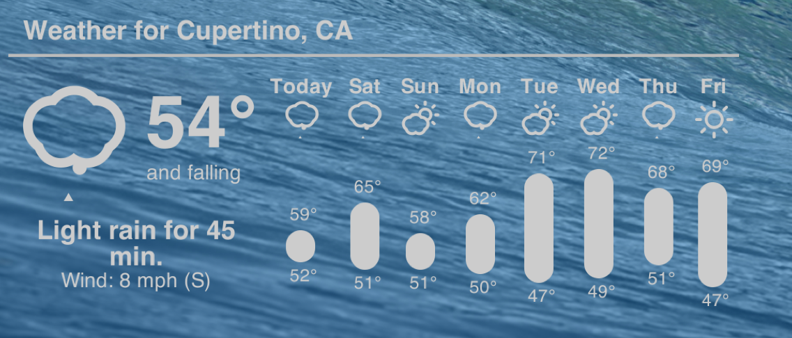
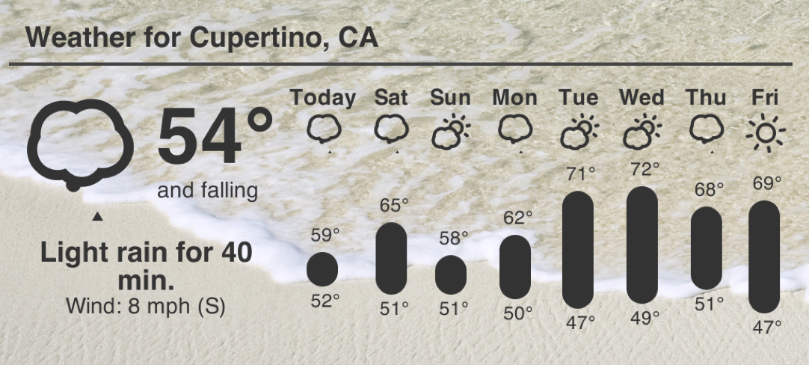

# Forecast.io Weather Geeklet

This is a Geeklet that will display the weather using the forecast.io embedable code. It uses phantomjs and imagemagick to render an image to display.

## Installation

Make sure you have a few things installed:

* [Homebrew](http://brew.sh/) (easiest way to install the following two packages)
* [ImageMagick](http://www.imagemagick.org/)
* [phantomjs](http://phantomjs.org/)

Once you have Homebrew installed, you can run the following command to install imagemagick and phantomjs:

`brew install imagemagick phantomjs`

### Clone the repo into a directory:

`git clone git@github.com:nickroberts/geektool-forecast.io-weather.git <your installation directory>`

### Get your location's latitude and longitude:
You can use the site [itouchmap](http://itouchmap.com/latlong.html) to find out your latitude and longitude.

### Create a Geektool script with the following format:

Replace the arguments with your own values.

`<your installation directory>/forecast.io.sh [-c COLOR -o OPACITY -f FONT -u UNITS] LATITUDE LONGITUDE TITLE`

#### List of available options:

##### Color:
You can use any hex color code value here. You might be able to use another type of color value, such as rgb, but this is untested. I would suggest staying with hex values.

##### Opacity:
Any value from 0.0 to 1.0. For a 35% opacity level, use the value to .35 to get the desired effect.

##### Font:
Should be able to use any font that is installed on your system, as PhantomJS should load it.

*Note: this isn't tested*

##### Units:
Can be one of the following:

* *us* for Fahrenheit and mph
* *uk* for Celsius and mph
* *ca* for Celsius and km/h
* *si* for Celsius and m/s

Set the script to refresh every 600s. (you can make this whatever you want)

Check the override text so that there is no text shown on the screen.

### Create an image Geektool Geeklet:

Update the image URL:

`file://localhost/<your installation directory>/weather.png`

Set the image to refresh every 300s. (you can make this whatever you want)

*Note: don't forget the file://localhost part, or else it will not find the image. You can also browse for the file.*

### You're now in business!

I've added the font, color, opacity and units options that forecast.io allows.

### Screenshots

Light:

Dark:
